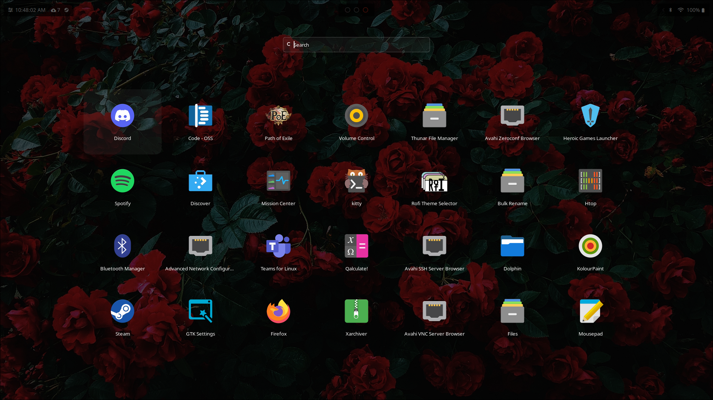
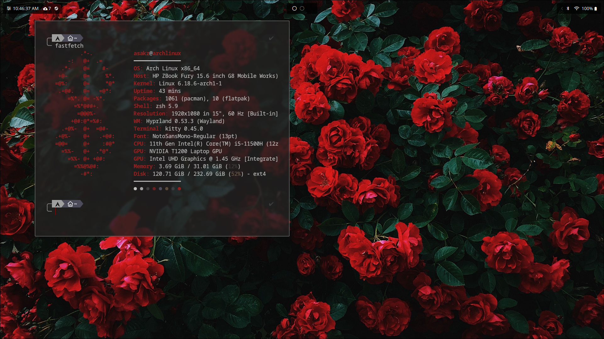

# Dotfile-Hyprland

There is no install yet, so feel free to grab whatever you please.

This rice has been inspired by many users on r/unixporn and youtube videos lol.

Also, I use Arch btw.

Tips : If you want to copy my config, the best wallpaper to use is the dark_rose.jpg in the wallpaper folder

## KEYBINDS : 

    bind = $mainMod, Q, exec, $terminal
    bind = $mainMod, C, killactive,
    bind = $mainMod, M, exit,
    bind = $mainMod, E, exec, $fileManager
    bind = $mainMod, V, togglefloating,
    bind = $mainMod, R, exec, ~/.config/rofi/launchers/type-3/launcher.sh	
    bind = $mainMod, P, pseudo, # dwindle
    bind = $mainMod, J, togglesplit, # dwindle
    bind = $mainMod, B, exec, firefox
    bind = $mainMod, W, exec, ~/.config/waybar/script/lauch.sh
    bind = $mainMod SHIFT, Print, exec, hyprshot -m region
    bind = $mainMod, Print, exec, hyprshot -m output
    bind = $mainMod, S, exec, spotify
    bind = $mainMod, D, exec, discord

## SCREENSHOTS : 

²